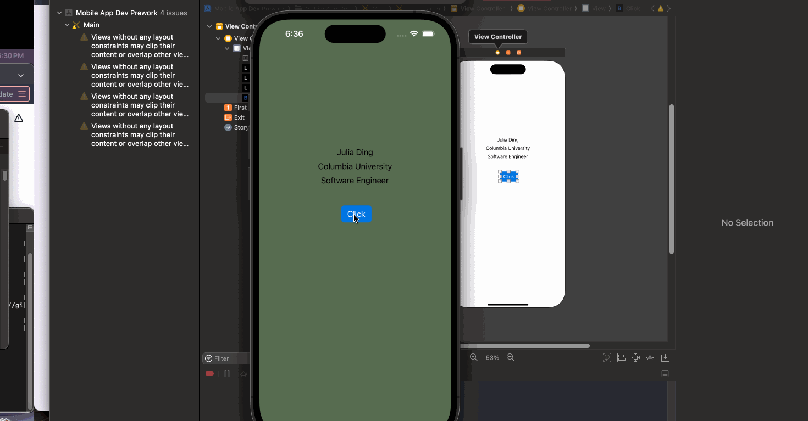

# Prework - *Mobile App Dev Prework*

Submitted by: **Julia Ding**

**Mobile App Dev Prework** is an app that uses some basic linkage of UI to Swift to customize the background of an app at random per click.

Time spent: **1** hour spent in total

## Required Features

The following **required** functionality is completed:

- [x] Users are see a screen with three labels and a button
- [x] Tapping the button changes the screen color to a random color
 
## Video Walkthrough

## App Brainstorming (Step 4)
### List of Apps
- Instagram: Ability to search history for messages, versatility in use of app, integration with other social apps like Facebook
- Notes: Easy to use, good for quick note-taking, built-in
- Spotify: Convenient mobile layout, straightforward UI
### App Improvement
Though Google Maps is often widely used for navigation in both driving and walking, its direction pointer in pedestrian use is often inaccurate. As such, a potential improvement on Google Maps could be to modify this feature and make it more reliable. The significance of this feature is important for not only efficiency but also safety reasons.

## Notes

Describe any challenges encountered while building the app.

## License

    Copyright [2024] [Julia Ding]

    Licensed under the Apache License, Version 2.0 (the "License");
    you may not use this file except in compliance with the License.
    You may obtain a copy of the License at

        http://www.apache.org/licenses/LICENSE-2.0

    Unless required by applicable law or agreed to in writing, software
    distributed under the License is distributed on an "AS IS" BASIS,
    WITHOUT WARRANTIES OR CONDITIONS OF ANY KIND, either express or implied.
    See the License for the specific language governing permissions and
    limitations under the License.
